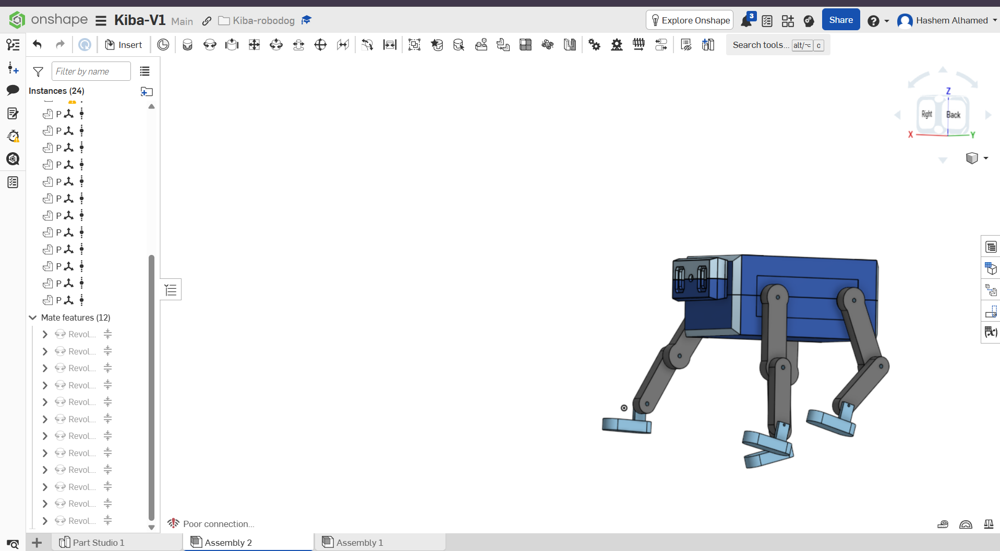

# Kiba-V1-Mechanics-Task3-4
A quadruped robotic dog concept designed in Onshape.
# Kiba RoboDog

## Overview

Kiba RoboDog is a quadruped robotic dog concept designed as a university CAD project. The model features a complete mechanical body, articulated legs, and a head prepared for a future camera module. The project focuses on mechanical design, assembly, and joint simulation while providing a solid foundation for future robotics and embedded systems integration.

## Features

- Complete quadruped robot design
- Four articulated legs
- Head with dedicated camera opening
- Parametric mechanical parts
- Revolute joints for leg articulation
- Mechanical assembly simulation
- Ready for future electronics integration

## Design Workflow

- Designed all mechanical parts in **Onshape**
- Created assemblies and tested joint movement using **Revolute Mates**
- Exported the project as **STEP** and **STL**
- Imported the complete model into **Autodesk Fusion 360**
- Recreated mechanical joints using **Revolute Joints**
- Verified articulation and assembly behavior inside Fusion 360

## Software

- Onshape
- Autodesk Fusion 360

## Exported Files

- STEP Assembly
- STL Files (Individual Parts)
- Complete Robot STL

## Future Improvements

- Servo motor integration
- ESP32 controller
- Camera module
- IMU sensor
- Autonomous walking
- Obstacle avoidance
- Voice interaction

## Preview

#link onshape [https://cad.onshape.com/documents/17c2906c2f0e56322c2b1101/w/ee3a93c163dcee260f0eae33/e/14665e41edda169961c8748b]
## Author

**Hashem Alhamed**  
Computer Science Student  
